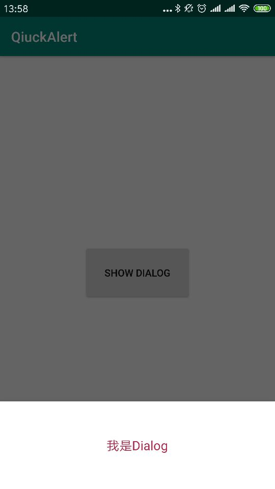

# QuickDialog
具有Dialog和PopupWindow的Dialog，可代替代Dialog和PopupWindow。

### 引入

```
allprojects {
		repositories {
			...
			maven { url 'https://jitpack.io' }
		}
	}


implementation 'com.github.wenkency:quickalert:1.7.0'

```

### 使用方式
```
public class MainActivity extends AppCompatActivity {

    @Override
    protected void onCreate(Bundle savedInstanceState) {
        super.onCreate(savedInstanceState);
        setContentView(R.layout.activity_main);


    }

    public void show(View view) {
        final QuickDialog popup = new QuickBuilder(this)
                .setContentView(R.layout.dialog_test)
                .setFullWidth()
                .isSetBackground(false)
                .fromBottom(true)
                .isDimEnabled(false)
                .build();
        // 显示在View的下面
        // popup.show(view);
        // 显示在View的下面，窗口宽居view中间
        popup.setOnClickListener(R.id.v_bg, new View.OnClickListener() {
            @Override
            public void onClick(View v) {
                popup.dismiss();
            }
        });
        // 比较特殊：自己定义模糊背景
        popup.showViewCenter(view, true);
    }
    // 显示中间和Dialog一样
    public void showScreen(View view) {
        final QuickDialog popup = new QuickBuilder(this)
                .setContentView(R.layout.dialog_window)
                .setWidthScale(0.8f)
                .build();
        popup.show();
    }
    // 显示在View的下面，且在中间
    public void showView(View view) {
        final QuickDialog popup = new QuickBuilder(this)
                .setContentView(R.layout.dialog_window)
                .setWidthScale(0.5f)
                .fromBottom(true)
                .isDimEnabled(false)
                .build();
        popup.showViewCenter(view);
    }
    // 显示在View的下面，和Popup一样
    public void showViewDown(View view) {
        final QuickDialog popup = new QuickBuilder(this)
                .setContentView(R.layout.dialog_window)
                .setWidthScale(0.5f)
                .fromBottom(true)
                .isDimEnabled(false)
                .build();
        popup.show(view);
    }
}

```

### 运行结果


